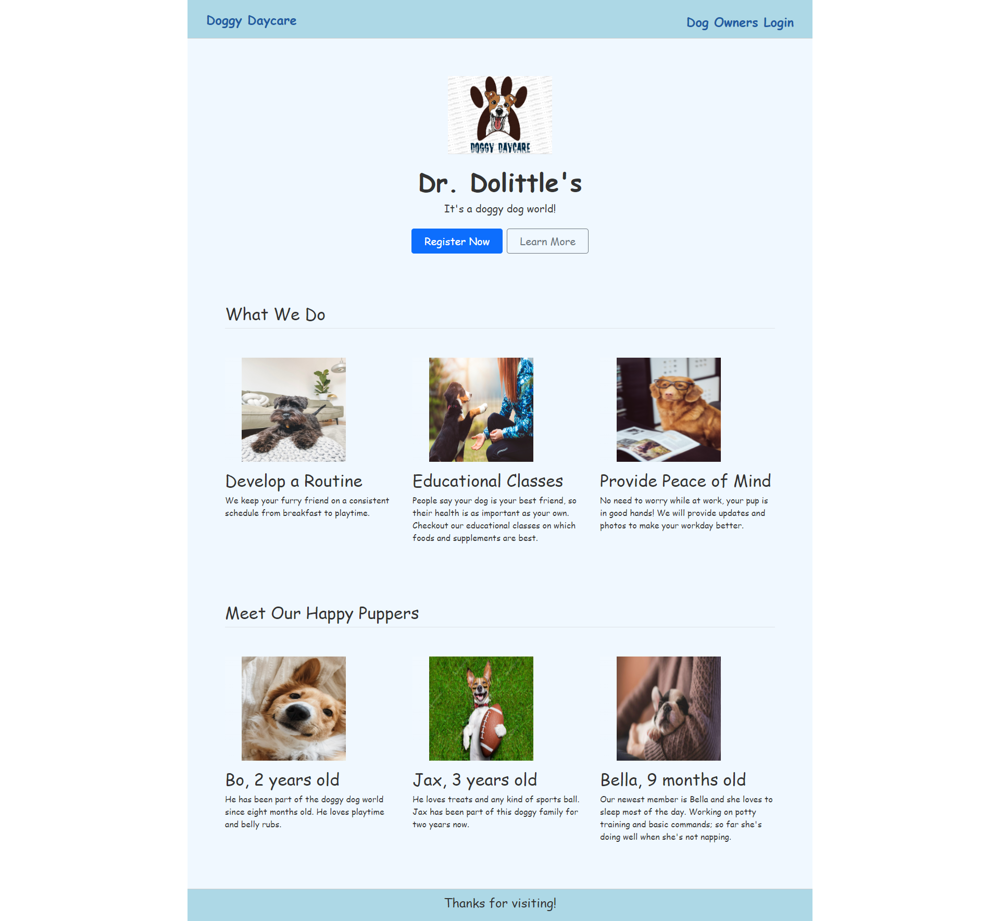
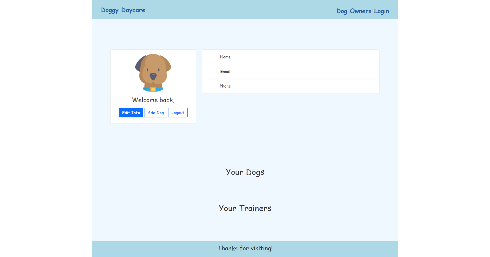

# Doggy-Daycare
[](https://bootcamp.msu.edu/)


## Technologies


## Description
Developed a web application that allows users to book an appointment at a dog daycare. The application allows users to add dogs to the portal as well as know who is the trainer for you dog. The motivation for the application is to provide a place for puppies to interact, be trained, as well as be loved while their owners are busy or at work.

## Installation
***Requirments***

[Node.js](https://nodejs.org/en/) | [MySQL](https://www.npmjs.com/package/mysql2)

***Once Installed:***
1. Clone the Repository to your machine in the folder of your choice.
2. Run the command ```npm install``` to download the dependency packages required.
3. Login to MySQL and run the command ```source db/schema.sql``` to create the database.
4. Run the command ```npm run seed``` to seed the database with placeholders.
5. Start the application with ```npm start```. 
6. The application will then run locally so check the website ```http://localhost:3001```.

## User Story
```
AS a Owner
I WANT a day-care center site
SO THAT I can keep tack of trainers and their dogs
```

## Acceptance Criteria
```
GIVEN a website
WHEN I visit the site for the first time
THEN I am presented with the homepage, which displays a button to register, learn more, and login
WHEN I click on the homepage option
THEN I am taken to the homepage
WHEN I click on any other links in the navigation
THEN I am prompted to sign in
WHEN I choose to sign up
THEN I am prompted to create a username, password, email, first & last name, and a phone number
WHEN I click on the sign-up button
THEN my user credentials are saved and I am logged into the site
WHEN I revist the site at a later time and choose to sign in
THEN I am prompted to enter my username and password
WHEN I am signed in to the site
THEN I see links for the homepage, edit, and the option to log out
WHEN I click on the add dog button
THEN I am prompted to enter information on the dog I own
WHEN I click on the logout option
THEN I am signed out of the site
```

## Screenshot
***Homepage***


***Dashboard***


## Link
A link to the [code](https://github.com/E-Lexis/Doggy-Daycare):
```
https://github.com/E-Lexis/Doggy-Daycare
```

A link to the deployed [Application](https://mysterious-temple-73208.herokuapp.com/):
```
https://mysterious-temple-73208.herokuapp.com/
```

## Developers
- :computer: [Elexis Blash](https://github.com/E-Lexis)
- :computer: [Alicia Jimenez](https://github.com/amjimenez)
- :computer: [Mo Yang](https://github.com/moyangdev)
- :computer: [William Strothe](https://github.com/wwstrothe)
- :computer: [Juan Garcia](https://github.com/jgarcia45)

## License
  Copyright (c) Elexis Blash. All rights reserved.
  
  Licensed under the [MIT](LICENSE) license.