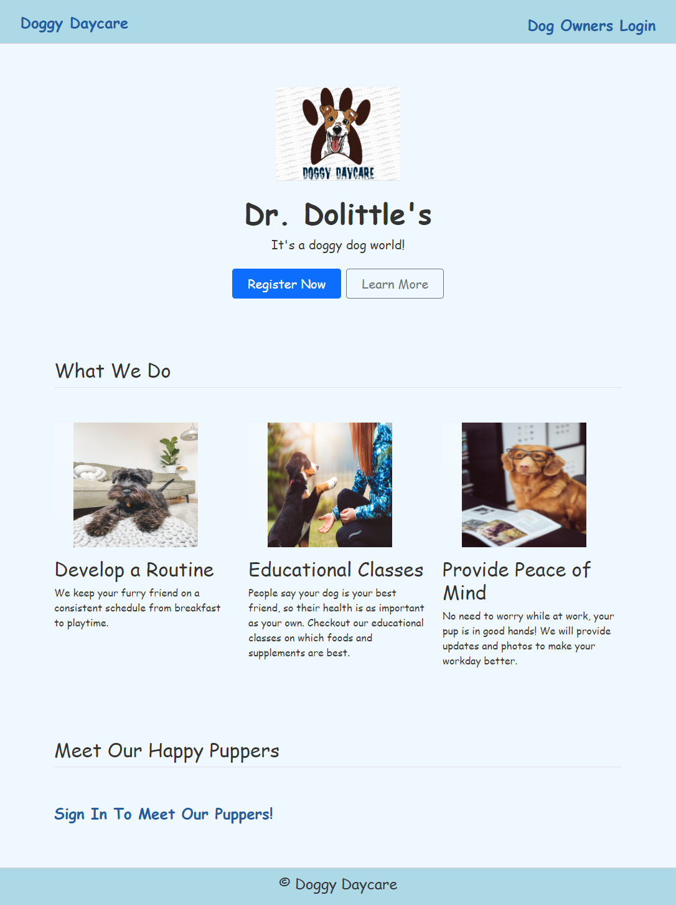
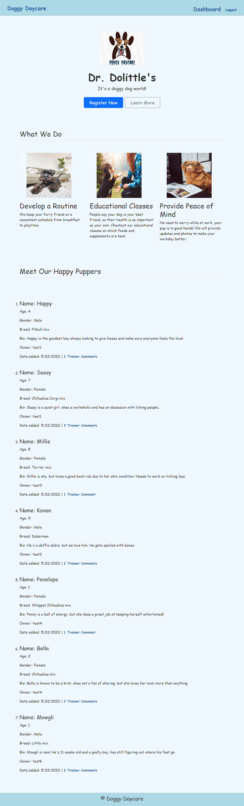

# Doggy-Daycare
[](https://bootcamp.msu.edu/)


## Technologies


## Description
Developed a web application that allows users to view and comment on other peoples dogs. The application allows users to add dogs to the portal and share their dogs information to help facilitate doggy play dates. The motivation for the application is to provide a place for puppies to interact, meet others, and form bonds.

## Installation
***Requirements***

[Node.js](https://nodejs.org/en/) | [MySQL](https://www.npmjs.com/package/mysql2)

***Once Installed:***
1. Clone the Repository to your machine in the folder of your choice.
2. Run the command ```npm install``` to download the dependency packages required.
3. Login to MySQL and run the command ```source db/schema.sql``` to create the database.
4. Run the command ```npm run seed``` to seed the database with placeholders.
5. Start the application with ```npm start```. 
6. The application will then run locally, so check the website ```http://localhost:3001```.

## User Story
```
AS a Dog Owner
I WANT a website where I can find other dogs to play with
SO THAT I can prove a fun, growth filled life for my dogs
```

## Screenshot
***Homepage***


***Signed Out Dashboard***


***Signed Out Dashboard***


## Link
A link to the [code](https://github.com/wwstrothe/Doggy-Daycare/tree/workingcode):
```
https://github.com/wwstrothe/Doggy-Daycare/tree/workingcode
```

A link to the deployed [application](https://vast-plains-21432.herokuapp.com/):
```
https://vast-plains-21432.herokuapp.com/
```

## Developers
-  [William Strothe](https://github.com/wwstrothe)
-  [Elexis Blash](https://github.com/E-Lexis)
-  [Alicia Jimenez](https://github.com/amjimenez)
-  [Mo Yang](https://github.com/moyangdev)
-  [Juan Garcia](https://github.com/jgarcia45)

## License
  Licensed under the [MIT](LICENSE) license.
